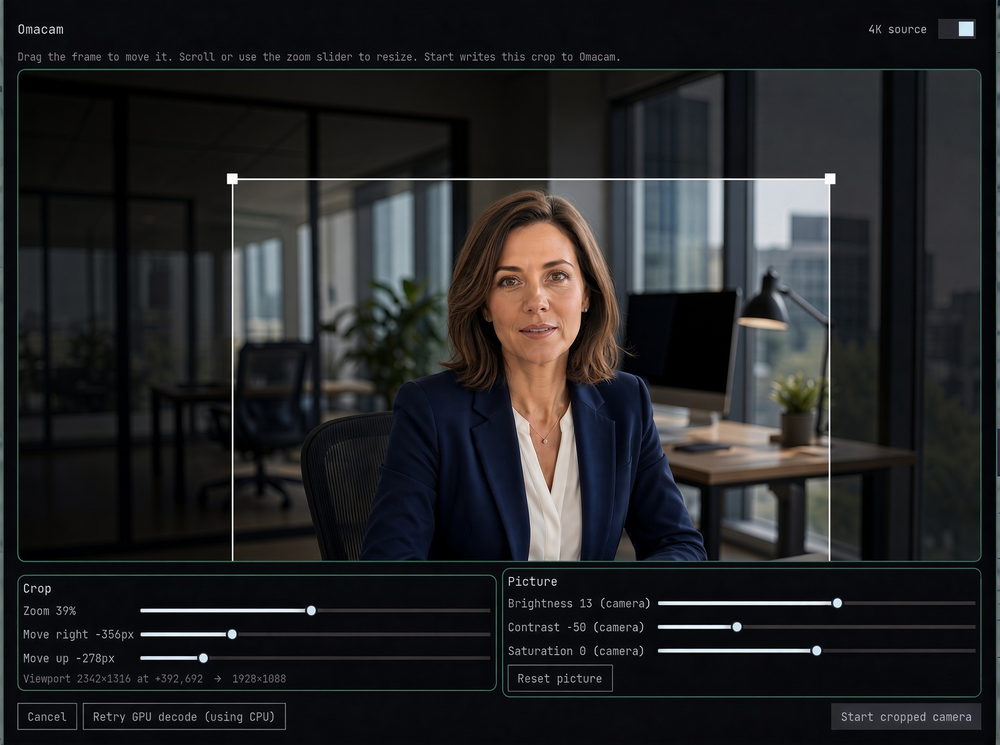

# Omacam

**Crop a 4K webcam to a sharp 1080p virtual camera for Omarchy.**

Meeting apps never send 4K. They open 720p or 1080p of the *whole room*, so zooming in is a mushy digital crop. Omacam reads the 4K sensor, crops the part you sit in, and presents that as a normal camera named **Omacam**.

[](https://plugins.omarchy.org)
[](LICENSE)



## Features

- **Bar toggle** — left-click starts or stops the pipeline. The icon lights up while live.
- **Visual framer** — right-click for a mirrored still (Meet-style self-view), a draggable 16:9 crop, zoom, and picture sliders.
- **On-demand ffmpeg** — idle until you turn it on. The encode process survives an Omarchy shell restart.
- **Picture controls** — brightness, contrast, saturation. Uses the camera’s UVC knobs when they exist; otherwise a cheap `eq` on the 1080p crop. Each slider is labelled `camera` or `software`.
- **Not 4K-in-Meet** — Zoom, Meet, and Teams still encode 720p/1080p. You just feed them a headshot sampled from more sensor pixels.

Looking for live exposure, gain, and a privacy shutter on the *physical* camera? That is [Omacam Control](https://github.com/kevinbsr/omacam-control) (`kevin.camera`). Complementary, not a replacement.

## Controls

| Action | Result |
| --- | --- |
| **Left-click** the bar icon | Start / stop the cropped camera |
| **Right-click** the bar icon | Open the framer |
| **Drag** the crop / corners / scroll | Move and zoom the 16:9 window |
| **Enter** / **Escape** in the framer | Start with this crop / cancel |
| **Arrow keys** | Nudge the crop (follows the mirrored preview) |

Last crop and picture values live in `~/.config/omacam/config.json`.

## Requirements

- [Omarchy](https://omarchy.org/) (Quattro / `omarchy-shell`)
- `ffmpeg`
- `v4l2loopback-dkms` and `v4l2loopback-utils`

On a typical Omarchy install the packages are already there. The loopback **module** is not loaded until you do the one-time sudo step below. Chrome and Zoom need `exclusive_caps=1` or they often refuse the device.

## Install

```bash
omarchy plugin add https://github.com/mrlund/omacam.git --enable
```

Then, once:

```bash
sudo ~/.config/omarchy/plugins/mrlund.omacam/scripts/install-loopback.sh
```

That writes `/etc/modules-load.d` and `/etc/modprobe.d` so **Omacam** appears on boot. You can do the same by hand:

```bash
echo v4l2loopback | sudo tee /etc/modules-load.d/v4l2loopback.conf
echo 'options v4l2loopback exclusive_caps=1 card_label="Omacam" devices=1' \
  | sudo tee /etc/modprobe.d/v4l2loopback.conf
sudo modprobe v4l2loopback exclusive_caps=1 card_label="Omacam" devices=1
```

If you skip this, the framer still works (it uses the real camera) but **Start** fails until the module is loaded. The first Start can also prompt for your password via polkit and run the same setup.

In Meet / Zoom / Chromium, pick **Omacam**, not the Logitech device. Start the pipeline *before* the app opens the camera picker.

Move the widget if you want:

```bash
omarchy bar move mrlund.omacam --section right
```

## Usage

1. Right-click the icon, frame yourself, **Start cropped camera**.
2. In the meeting app, choose **Omacam**.
3. Left-click the icon when the call is over. That is what drops CPU and USB load — enabling the plugin is free.

Cancel (Esc or click outside) restores the previous crop. If the camera was already live, it restarts.

```bash
~/.config/omarchy/plugins/mrlund.omacam/scripts/omacam start
~/.config/omarchy/plugins/mrlund.omacam/scripts/omacam stop
~/.config/omarchy/plugins/mrlund.omacam/scripts/omacam status
~/.config/omarchy/plugins/mrlund.omacam/scripts/omacam doctor
```

## Cost

The plugin UI is cheap. **ffmpeg is not.** While live it decodes 4K MJPEG (most of the CPU), crops, and writes 1080p YUYV into the loopback. USB cameras send JPEG, not H.264, so NVIDIA NVDEC usually cannot help. Omacam probes once (first framer open, or **Retry GPU decode**) and stores `cpu` or `cuda` in config. 4:2:2 MJPEG almost always stays on CPU; that is expected.

Turn it off between calls. Do not autostart it at login. Opening the framer pauses the live pipeline so it can grab the physical camera (UVC is exclusive).

## Uninstall

```bash
omarchy plugin remove mrlund.omacam
```

That does not unload `v4l2loopback` or the two files under `/etc`. Leave them if you still want a virtual camera; otherwise:

```bash
sudo rm /etc/modules-load.d/v4l2loopback.conf /etc/modprobe.d/v4l2loopback.conf
sudo modprobe -r v4l2loopback
```

## Troubleshooting

| Symptom | Likely cause |
| --- | --- |
| Bar tooltip “Need: v4l2loopback module…” | Loopback setup skipped, or no reboot / `modprobe` yet |
| Meeting app shows a black Omacam | Start the pipeline *before* opening the camera picker |
| Physical webcam missing from apps | Expected while Omacam is live — ffmpeg holds it |
| `ffmpeg exited immediately` | Another app has the webcam, or the loopback node is missing |
| Crop looks soft | Turn **4K source** on so the crop is a downsample, not an upscale |

## License

[MIT](LICENSE) © 2026 Martin Lund
